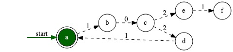
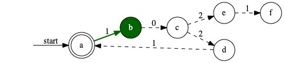
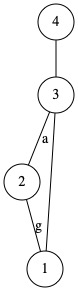
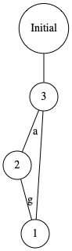

# REST-API
This file contains a sketch of the IPM REST-API between the client and the server. It will serve as an interface for sending and manipulating different kinds of models defined in a user-specified <code>.mc</code> file. The API is divided into three main categories:
- INIT
- TRANSITION
- OUTPUT

The response to all requests include a data object with one or several models where each model has the following attributes:
- <code>type</code> - Ex: "dfa", "nfa", "graph".
- <code>id</code> - A unique number used for model specific requests.
- <code>model</code> - The model in dot-syntax.
- <code>simulation</code> - An object with simulation information (only included for models with simulation).


## INIT

#### REQUEST - ALL MODELS
The following request retrieves all the models defined in the user-specified <code>.mc</code> file. The models is returned in their initial state.

<code>GET: BASE_URL + "/all-models"</code>

###### Sample output
```json
{
    "data" : {
        "models" : [
            {
                "type" : "nfa",
                "id" : 0,
                "model" : "digraph {rankdir=LR;node [style=filled fillcolor=white shape=circle];
    start[fontcolor=white color=white];a[shape=doublecircle fillcolor=darkgreen fontcolor = white];b[  ];c[  ];d[  ];e[  ];f[  ];start -> a [label=start ];a -> b [label=1 color=darkgreen style=bold];b -> c [label=0 color=black style=dashed];c -> d [label=2 color=black style=dashed];c -> e [label=2 color=black style=dashed];d -> a [label=1 color=black style=dashed];e -> f [label=1 color=black style=dashed];}",
                "simulation" : {
                    "status" : "OK",
                    "current-input-index" : 0,
                    "input" : ["start", "1", "0", "2", "2"]
                }
            },
            {
                "type" : "graph",
                "id" : 1,
                "model" : "graph {rankdir=TB;node [style=filled fillcolor=white shape=circle];4[];3[];2[];1[];4 -- 3 [];3 -- 1 [];3 -- 2 [label=a ];2 -- 1 [label=g ];}"
            }
        ]
    }
}
```

#### REQUEST - UPDATE INPUT
This request updates the input for a specific model and reset the model to its initial state. Note: Only valid for models with input.

```js
url: BASE_URL + "/init/input",
method: "POST",
headers: {"Content-Type": "application/json"},
body: {
  "id": {model-id}, // Might be better to have the id as a parameter in the url?
  "input" : {new-input}
}
```

###### Sample request body
```js
body: {
  "id": 0,
  "input" : "1000"
}
```

###### Sample output
```json
{
    "data" : {
        "type" : "nfa",
        "id" : 0,
        "model" : "digraph {rankdir=LR;node [style=filled fillcolor=white shape=circle];start[fontcolor=white color=white];a[shape=doublecircle];b[  ];c[  ];d[  ];e[  ];f[  ];start -> a [label=start style=solid];a -> b [label=1 ];b -> c [label=0 ];c -> d [label=2 ];c -> e [label=2 ];d -> a [label=1 ];e -> f [label=1 ];}",
        "simulation" : {
            "status" : "OK",
            "current-input-index" : 0,
            "input" : ["start", "1", "0", "0", "0"]
        }
    }
}
```

## TRANSITION
The requests under this category are responsible for changing the state of a specific model. The state transition function called when handling the request is specialized and specific for each model.
Ex: In the case of a DFA/NFA, the next state refers to the next configuration.

#### REQUEST - NEXT STATE

<code>GET: BASE_URL + "/transition/next?id={model-id}"</code>  

#### REQUEST - PREVIOUS STATE

<code>GET: BASE_URL + "/transition/previous?id={model-id}"</code>

###### Sample request
<code>GET: BASE_URL + "/transition/next?id=0"</code>

###### Sample output
```json
{
    "data" : {
        "type" : "nfa",
        "id" : 0,
        "model" : "digraph {rankdir=LR;node [style=filled fillcolor=white shape=circle];start[fontcolor=white color=white];a[shape=doublecircle];b[fillcolor=darkgreen fontcolor = white];c[  ];d[  ];e[  ];f[  ];start -> a [label=start ];a -> b [label=1 color=darkgreen style=bold];b -> c [label=0 color=black style=dashed];c -> d [label=2 color=black style=dashed];c -> e [label=2 color=black style=dashed];d -> a [label=1 color=black style=dashed];e -> f [label=1 color=black style=dashed];}",
        "simulation" : {
            "status" : "OK",
            "current-input-index" : 1,
            "input" : ["start", "1", "0", "0", "0"]
        }
    }
}
```
###### Visualized model before the request


###### Visualized model after the request


## OUTPUT

#### REQUEST - SET NODE (STATE) PROPERTIES
This request makes it possible to change the properties of the nodes/states in a specific model.

```js
url: BASE_URL + "/output/set-node-properties",
method: "POST",
headers: {"Content-Type": "application/json"},
body: {
  "id" : {model-id},
  "values" : [
    {
      "node-id" : {node-id},
      "properties" : {
        "label" : {new-label}
      }
    }
  ]
}
```

The <code>values</code> must be an array of objects with two attributes <code>node-id</code> and <code>properties</code>. Valid attributes for the <code>properties</code> are "label" (to be extended).

###### Sample request body

```js
body: {
  "id" : 1,
  "values" : [
    {
      "node-id" : 4,
      "properties" : {
        "label" : "Initial"
      }
    }
  ]
}
```

###### Sample output
```json
{
    "data" : {
        "type" : "graph",
        "id" : 1,
        "model" : "graph {rankdir=TB;node [style=filled fillcolor=white shape=circle];4[label=Initial];3[];2[];1[];4 -- 3 [];3 -- 1 [];3 -- 2   [label=a];2 -- 1 [label=g];}"
        }
    }
}
```

###### Visualized model before/after the request


